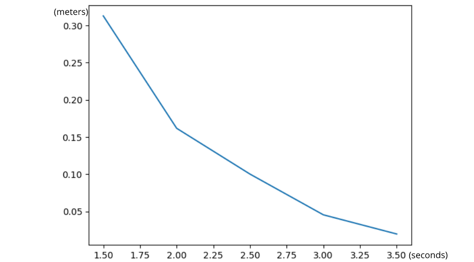
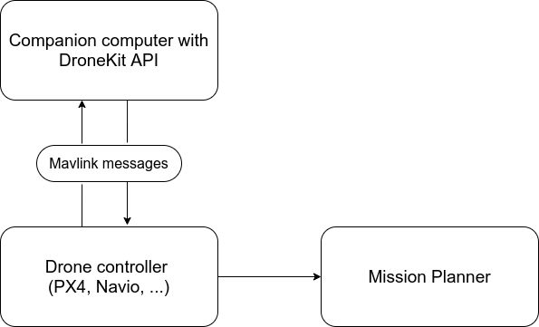

# 
 Integration of a GPS-free navigation technique in the DroneKit API 

  The goal of this work is to provide a technique that will allow a drone using the [DroneKit API](https://github.com/dronekit/dronekit-python) to navigate thourgh indoor environements where the GPS signal is not availabale.
  We begin from the hypothesis that we have no acess to the hardware of the UAV, this eliminate the posibility of adding state estimation sensors to substiture the GPS signal. So we consider a solution that is able to guide the robot by providing elemntary movements to get outside of the indoor zone.
  
## Working principle
This project is forked from a repository that provide a partial solution for navigation that allow the drone to hover at a certain altitude only. The contribution of this technique is to provide to the drone the ability to make few elemntary movement in fixed altitude (approximately one meter per movement) towards known waypoints without knowing the state of system (open loop navigation). We will apply a low-level regulation to the drone for a specific time period so the system can move to the target. 
This strategy is known for it's lack of precision, it can be used only within the use case precision requirements.

  ### Parameters of the regulation
   Besides the duration of regulation, we consider two main parameters that influences the drone's linear velocity which are : thrust and pitch angle values.
   Furthermore, we define the yaw angle of the drone as the parameter of orientation of the drone. It will be determined through the relative position of the 
   target
   (represented in 2D position frame ) according to the current position of the drone. 
   The thrust, pitch and duration parameters where tuned to determine the combination that can make the drone travel following a straight line for one meter taking 
   in consideration the error of estimation.
 ## Results of tests 
  This figure show us the results of our experimentation tests, we changed the time of appliance of the regulation and observed its influence on the error in the 
  estimation of the distance that the drone will travel. 
  
  
  

  <em>Evolution of the error in estimation depending on the duration of regulation</em>
  

  We notice that the error in the estimation decrease with the augementation of the duration parameter. This means that the drone should decrease it's speed to 
  remain in the on meter per trajectory limit. 
  We choose 3s for the elementary trajectory, this means that the drone will have a mean speed of 0.33 m/s.
  
 ## Expirimentation environement 
  The next diagram show the scheme of the environement of simulation. The algorithm is executed on a companion computer (Rpi, Odroid, Jetson series, ...) that 
  comunicate with the drone controler. 
  We use the 
  [Ardupilot](https://github.com/ArduPilot/ardupilot)
  framework whith the 
  [Mission Planner SITL](https://ardupilot.org/planner/docs/mission-planner-simulation.html)
  simulator to accomplish simulation tests. The results obtained are therefore suited to the model of the quadcopter [Arducopter](https://github.com/ArduPilot/ardupilot/tree/master/ArduCopter). 
  
  

  <em>Structure of the simulation test environement</em>
  

  
  
  
